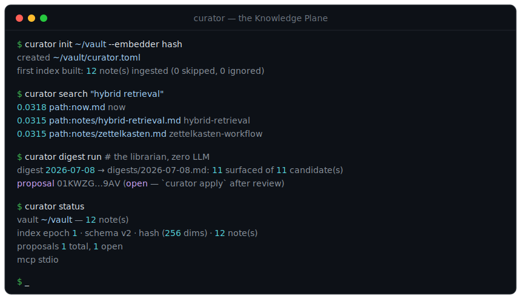
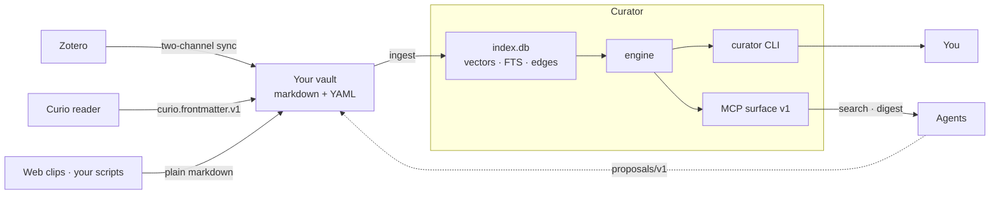

# Curator

[](https://github.com/alexnodeland/curator/actions/workflows/ci.yml)
[](https://github.com/alexnodeland/curator/releases)
[](LICENSE)


> **v0.1.0** — the first public release. The four contracts are v1; the Rust
> APIs are pre-1.0 and still settling. **Website:**
> <https://alexnodeland.github.io/curator/> ·
> Roadmap: [docs/design/roadmap.md](docs/design/roadmap.md).



Curator is the knowledge plane under your personal knowledge system:
**any plain-markdown vault** + **one embedded index** + **MCP for agents** +
**a deterministic librarian**. One binary, one SQLite file — no daemon, no
service, no telemetry.

- **Your notes stay plain files.** A markdown+YAML directory under git is the
  whole canonical store; the index is derived and disposable — rebuilt, never
  migrated. No plugin, no proprietary format, no live editor required. Bring
  your own viewer.
- **Agents are first-class readers.** One MCP entrypoint gives any agent
  search, retrieval, and relatedness over your whole corpus, citations
  included.
- **Agents propose, you decide.** The only write path is a validated,
  human-applied proposal. No tool anywhere in the surface writes your notes
  directly.
- **The librarian is deterministic.** Ranked, grouped digests of what's new
  against your current interests — zero LLM required; an agent harness is an
  optional prose enhancer.

> Anything that writes conforming markdown+frontmatter into the vault is a
> valid producer. That sentence is the whole integration story — the Curio
> reader, Zotero, web clips, and your own scripts all plug in the same way.

## What it does

| | |
|---|---|
| 🔎 **Hybrid search** | sqlite-vec vectors + FTS5 BM25 + relational edges, fused with reciprocal-rank fusion — `hybrid` \| `vector` \| `fts`, from the CLI or MCP |
| 🧭 **One index, disposable** | a single embedded `index.db` with blue/green epochs — a crashed rebuild never touches the serving copy; derive it, never migrate it |
| 🤖 **MCP for agents** | one entrypoint, six tools (`search` / `get_note` / `related` / `recent` / `propose` / `digest_latest`) over stdio or bearer-authenticated HTTP |
| 📰 **Deterministic librarian** | ranked, grouped digests of what's new against your `now.md` interests — zero LLM, byte-identical for identical inputs |
| ✍️ **Agents propose, you decide** | the only write path is a validated, human-applied `proposals/v1` changeset; `.curio/` and managed regions are hard-rejected |
| 📚 **Zotero, two-channel** | read-only delta + fulltext sync into plain notes — citekey-named, RFC3339 dates, DOI / tags / abstract mapped |
| 📥 **Producers, not plugins** | any tool that writes conforming markdown is a source: the Curio reader, browser web-clips, your own scripts |
| 🧩 **Embed your way** | in-process ONNX (`bge-small`, 384-dim) or an offline deterministic `hash` embedder — one config switch, no model server |
| 🩺 **Operable** | `curator doctor` health checks + `curator status` snapshot, `--json` on every command, Docker/compose profiles (`core` \| `zotero` \| `librarian`) |
| 🔒 **Local-first & private** | one binary, one SQLite file — no daemon, no accounts, no telemetry; your notes stay plain files under your own git |

## How your knowledge flows



## Install

The primary install is Cargo, straight from the source tree:

```sh
git clone https://github.com/alexnodeland/curator && cd curator
cargo install --locked --path crates/curator-cli
curator --version
```

(equivalently, without a checkout:
`cargo install --locked --git https://github.com/alexnodeland/curator curator-cli`)

Other channels:

- **Release binaries** — every `v*` tag builds `curator` for linux x86_64 +
  macOS arm64 with `SHA256SUMS` into a *draft* GitHub release
  ([`.github/workflows/release.yml`](.github/workflows/release.yml)); a human
  reviews and publishes.
- **Containers** — [`Dockerfile`](Dockerfile) (multi-stage, slim runtime) +
  [`compose.yaml`](compose.yaml) with profiles `core` (MCP over HTTP) |
  `zotero` (sync loop) | `librarian` (scheduled digests). Config + vault are
  bind mounts; secrets enter via env only.
- **crates.io** — a staged follow-up, deliberately not published while
  pre-release.

## Quickstart

No model server, no database service, no daemon — one binary, one SQLite
file. Try the whole loop on the bundled sample vault first — offline,
deterministic, non-interactive:

```sh
just demo      # scratch-dir init → ingest → search → digest walk-through
```

**Two downloads to know about up front.** The default build compiles the
in-process ONNX embedder: `cargo build`/`cargo install` fetches ONNX Runtime
binaries (via the `ort` download feature) at build time, and the first command
that embeds (e.g. default-config `curator init` / `curator ingest`) fetches the
pinned ~130 MB embedding model from Hugging Face into `.kp/models/` (one-time,
announced with a progress bar). For a fully-offline or lean setup: set
`embedder = "hash"` in `curator.toml` (deterministic, no ML), or build with
`cargo build -p curator-cli --no-default-features` — that binary has no ONNX
stack and performs zero downloads at build or run time.

Copy [`curator.example.toml`](curator.example.toml) to `curator.toml` (the
legacy `kp.toml` name is still accepted) and point `[vault].path` at your
markdown directory — or let `curator init` scaffold one. `curator --help`
lists the surface: ingest, index rebuild, Zotero sync, search / get / related /
recent, `mcp serve`, propose / review / apply, the librarian digest, doctor,
and status. (Pre-release: APIs are still settling — `docs/design/` is the
design record.)

For development: `just` lists the front door (`just ci` = exactly what CI
runs).

## The four contracts

Everything that crosses the system boundary is one of four published
contracts; everything else is internal and changes freely.

| contract | governs | spec |
|---|---|---|
| `kp-note/v1` | note identity + enrichment frontmatter | [contracts/kp-note/v1.md](contracts/kp-note/v1.md) |
| `kp-config/v1` | `curator.toml` configuration (legacy name `kp.toml`) | [contracts/kp-config/v1.md](contracts/kp-config/v1.md) |
| `proposals/v1` | the only agent write path | [contracts/proposals/v1.md](contracts/proposals/v1.md) |
| MCP surface v1 | the agent tool surface | [contracts/mcp/v1.md](contracts/mcp/v1.md) |

Any producer that writes conforming markdown+frontmatter into the vault is a
valid producer — that sentence is the whole integration story. The sibling
Curio reader and Zotero integrate this way (see
[docs/design/architecture.md](docs/design/architecture.md)).

## Documentation

The docs site — quickstart, concepts, integrations, operations, and the full
config/CLI/MCP reference — is generated deterministically from
[`docs/site/`](docs/site/) by the in-repo generator (`just site`, implemented
in `xtask/src/docs.rs`) and deployed to GitHub Pages on every push to `main`
([`.github/workflows/pages.yml`](.github/workflows/pages.yml)). Build it
locally into `target/site/` with `just site-open`.

## Contributing

See [CONTRIBUTING.md](CONTRIBUTING.md), [GOVERNANCE.md](GOVERNANCE.md),
[SECURITY.md](SECURITY.md), and the
[Code of Conduct](CODE_OF_CONDUCT.md).

## License

[MIT](LICENSE) © 2026 Alex Nodeland.
