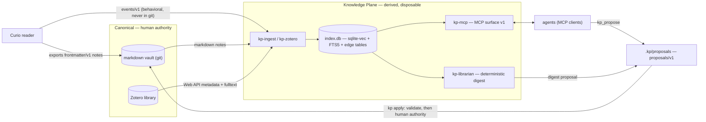

# Knowledge Plane — architecture

> **Status:** design baseline for the v1 build. The four published contracts referenced here
> are authoritative; everything else in this document describes internals that may change
> freely.

## What this is

The Knowledge Plane is **knowledge infrastructure, not another notes app**. It turns any
plain-markdown git directory (your vault) plus an optional Zotero library into one
addressable substrate for reading, notes, and references — with **published contracts** at
every boundary, so any producer, any reader, and any agent can plug in without bespoke glue.

Two commitments define the category:

1. **Agents are first-class citizens.** The system's primary consumer surface is MCP:
   an agent searches, reads, relates, and proposes against your corpus with the same
   fidelity a human gets — citations included.
2. **Humans keep final authority.** Agents never write canonical content directly.
   The *only* write path is `proposals/v1`: an agent proposes a changeset, a deterministic
   validator checks it, and a human applies it. No exception exists anywhere in the tool
   surface.

## The sacred split: canonical vs derived

| | Canonical (yours) | Derived (the plane's) |
|---|---|---|
| What | Plain-markdown vault (git), Zotero library | `index.db`, caches, cursors, digests-in-flight |
| Owner | Human (and producer apps like Curio, inside their marked regions) | Knowledge Plane |
| Loss cost | Real | Zero — rebuild from canonical |
| Upgrade story | Never forced | **Blue/green epoch rebuilds, never migrations** |

The vault is any markdown+YAML directory under git. Obsidian is a recommended viewer and
nothing more — no component ever requires a live editor, a plugin, or a proprietary format.

### One embedded index

All derived retrieval state lives in **one embedded SQLite file** (`index.db`):

- **vectors** — `sqlite-vec` virtual tables (chunk embeddings),
- **full-text** — SQLite **FTS5** (BM25),
- **graph** — plain **relational edge tables** (links, claims, supports/refutes), queried
  with recursive CTEs for one-hop expansion.

WAL mode makes it multi-process-safe (stdio MCP servers spawn per client session while the
indexer writes). There is no graph database, no vector service, no external store of any
kind in the core: zero-infra by construction. See
[decisions.md](decisions.md) for why the alternatives were killed.

**Epochs, not migrations.** An index epoch is a pure function of *(embedding model + dims,
chunker version, normalization version)*. Any mismatch — including swapping the embedding
model — triggers a rebuild into `index.db.next`, a completeness check, then an atomic
rename. Mixed-model indexes are forbidden; a mid-rebuild crash leaves the serving epoch
untouched. Software version bumps never invalidate an epoch.

## Crate map

Six library crates plus one binary, in a single cargo workspace:

| crate | responsibility |
|---|---|
| `kp-core` | vault model and atomic I/O, `kp-note/v1` frontmatter parse/validate, identity minting and resolution, checksum-as-change-token, `kp.toml` loading (`kp-config/v1`), Curio manifest ownership oracle, `proposals/v1` create/validate/apply |
| `kp-ingest` | producers → vault/index: the Curio adapter (vanilla `curio.frontmatter.v1` notes, `curio.events.v1` tail with rotation-aware `(file, line)` cursors and `event_id` dedupe), web clips, ingest orchestration |
| `kp-index` | chunker, `Embedder` trait (`builtin` pinned CPU ONNX, `hash` deterministic test embedder), `index.db` schema, incremental reindex, hybrid retrieval (RRF fusion over vector + FTS legs, one-hop edge expansion), blue/green epoch machinery |
| `kp-zotero` | two-channel Zotero access: Web API metadata (delta polling via `Last-Modified-Version`, `/deleted` tombstones) + official `/fulltext` as the primary fulltext source, with a small CRC-verified WebDAV `.prop`/`.zip` fallback for self-hosted attachment stores; literature stubs land via proposals, keyed strictly on `zotero:<itemKey>` |
| `kp-mcp` | the one MCP entrypoint (built on `rmcp`): stdio default, streamable HTTP + bearer token optional — MCP surface v1 |
| `kp-librarian` | deterministic-first maintenance and digest loops (see below); optional LLM harness adapter as a prose enhancer |
| `kp` (binary) | the CLI: `init`, `ingest`, `reindex`, `search`, `mcp`, `propose`/`review`/`apply`, `digest`, `status` |

Dependency direction is strictly downward: `kp` → (`kp-ingest`, `kp-zotero`, `kp-mcp`,
`kp-librarian`) → `kp-index` → `kp-core`. Retrieval is in-process — the MCP server links
`kp-index` directly; there is no internal network API.

## Exactly four published contracts

Everything that crosses the system boundary is one of these four. Everything else —
`index.db` schema, embedder internals, cursor formats, cache layouts — is internal and
changes freely.

| contract | what it governs |
|---|---|
| **`kp-note/v1`** | note identity + enrichment frontmatter. `kp_id` is producer-namespaced (`curio:<uuidv7>` \| `zotero:<itemKey>` \| `kp:<uuidv7>` \| `path:<relpath>` fallback). `checksum` is a **change token only, never identity**. **No `status` field** — lifecycle lives index-side. |
| **`kp-config/v1`** | `kp.toml`: vault path, index path + embedder, Curio seam, Zotero seam, librarian tuning, MCP transport. Unknown keys warn, never fail; secrets only via env/keychain indirection. |
| **`proposals/v1`** | the only agent write path: `<vault>/.kp/proposals/<ULID>/` with `proposal.json` + `changes.patch`; `kp propose` / `kp review` / `kp apply` run one deterministic validator. **Local-first and forge-free** — the safety model works with no git remote at all. |
| **MCP surface v1** | `kp_search`, `kp_get_note`, `kp_related`, `kp_recent`, `kp_propose`, `kp_digest_latest`. Tool names/shapes are the contract: adding tools is a minor version, changing shapes is a major. |

Contract discipline: additive changes in minors, breaking changes in majors, per-contract
changelogs. Consumers pin versions.

## System flow

### Producers feed ingest

- **Curio** (the sibling OSS reader) integrates **by adapter, never by template**: the
  Knowledge Plane consumes *vanilla* `curio.frontmatter.v1` notes and `curio.events.v1`
  JSONL against vendored, sha-pinned schemas. `.curio/manifest.json` is read as the
  write-ownership oracle: manifest-listed paths are Curio-owned at the managed-region
  level, proposals touching `.curio/**` are hard-rejected, and KP enrichment of Curio
  notes is companion content *below* the managed region plus frontmatter keys outside
  Curio's machine-key set — never inside. Events are behavioral reading history: tailed
  from a local state directory, deduped by `event_id`, and **never committed to git**.
- **Zotero** is **two-channel**: metadata rides the Zotero Web API (delta polling,
  deletion tombstones); fulltext comes from the official `/fulltext` endpoint first, with
  a ~30-line CRC-verified `.prop`/`.zip` WebDAV fallback for self-hosted attachment
  stores. Literature-note stubs enter the vault via proposals, keyed on
  `zotero:<itemKey>` — a citekey rename is a rename proposal, never a duplicate stub.
- **Anything else** that writes conforming markdown+frontmatter into the vault is a valid
  producer. That sentence *is* the integration story: the contracts are published so the
  adapter list never needs to be.

### Ingest feeds index; retrieval is MCP

Ingest normalizes into the vault and the indexer; the indexer maintains `index.db`
incrementally (full-file hashes, so frontmatter-only edits update metadata rows without
re-embedding). Retrieval is served exclusively through the MCP surface — one entrypoint,
stdio by default so any MCP client gets the whole corpus with one config entry; streamable
HTTP with a bearer token for network deployments.

### The librarian is deterministic-first

The baseline librarian requires **zero LLM**: the candidate set is notes since the last
digest, scored `cosine(note, now.md anchor) × exp(−age/half-life)`, top-k grouped by
tag/source, rendered as a digest note with links and extractive one-line summaries, and
delivered as a proposal (auto-applicable only when it purely *adds* files under the digest
directory). An agent harness (e.g. Claude Code) is an **optional enhancer** that rewrites
prose on top of the deterministic skeleton — via proposals, like every other agent. The
system is fully functional without it.

### Proposals are the only write path

`kp propose` captures a changeset; the validator hard-rejects anything touching
`.curio/**`, Curio machine frontmatter keys or managed regions, paths outside the vault,
or patches that don't apply cleanly; `kp review` renders it; `kp apply` applies and stamps
status. The identical validator can run as a forge CI gate for hardened remote
deployments — but the forge is optional. A laptop with no remote gets the full safety
model.

## What the product does not know

The product code has no concept of any particular LLM vendor, git forge, notification
service, database service, or host topology. A CI grep gate enforces, from the first
commit, that product code and contracts contain zero references to any private
reference-deployment service. Where deployment choices exist, they are seams:
the embedder is a trait (v1 ships the pinned in-process CPU ONNX default plus the
deterministic test embedder; remote embedding endpoints are a post-v1 backend), the MCP
transport is config, the vault is any git directory, and hardened forge-side validation
is an optional tier over the same validator module.
