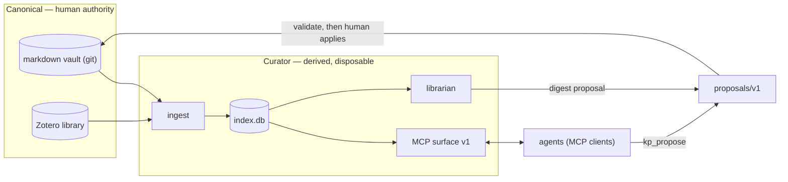

# Concepts

Five minutes of design commitments. Two of them define the category:

1. **Agents are first-class citizens.** The system's primary consumer
   surface is MCP: an agent searches, reads, relates, and proposes
   against your corpus with the same fidelity a human gets — citations
   included.
2. **Humans keep final authority.** Agents never write canonical
   content directly. The *only* write path is `proposals/v1`: an agent
   proposes a changeset, a deterministic validator checks it, a human
   applies it. No exception exists anywhere in the tool surface.

## The sacred split: canonical vs derived

The one rule everything else follows from: **the vault is canonical,
the index is derived.**

| | Canonical (yours) | Derived (the plane's) |
|---|---|---|
| What | plain-markdown vault (git), Zotero library | `index.db`, caches, cursors, digests-in-flight |
| Owner | human (and producer apps, inside their marked regions) | Curator |
| Loss cost | real | **zero — rebuild from canonical** |
| Upgrade story | never forced | blue/green epoch rebuilds, never migrations |

The vault is any markdown+YAML directory under git. No component ever
requires a live editor, a plugin, or a proprietary format — a viewer
like Obsidian is [recommended and optional](integrations/obsidian.md).
Everything derived is disposable by construction: deleting `index.db`
loses nothing that `curator index rebuild` doesn't restore.

## One embedded index

All derived retrieval state lives in **one embedded SQLite file**:

- **vectors** — `sqlite-vec` virtual tables (chunk embeddings),
- **full-text** — SQLite FTS5 (BM25),
- **graph** — plain relational edge tables (links), queried for one-hop
  expansion.

Hybrid search fuses the vector and full-text legs with reciprocal-rank
fusion. WAL mode makes the file multi-process-safe: stdio MCP servers
spawn per client session while the indexer writes. There is no graph
database, no vector service, no external store of any kind — zero-infra
by construction.

## Epochs, not migrations

An index epoch is a pure function of *(embedding model + dims, chunker
version, normalization version)*. Any mismatch — including swapping the
embedding model — triggers a rebuild into a fresh epoch: build the new
index beside the old one, verify completeness, swap atomically. Mixed
embedding spaces are forbidden; a mid-rebuild crash leaves the serving
epoch untouched; software version bumps never invalidate an epoch.

The operational consequence is the whole
[upgrade story](operations.md#upgrade-by-rebuild): there is no schema
migration to run, ever. `curator doctor` tells you when the configured
embedder and the index disagree; `curator index rebuild` fixes it.

## Identity: minted, never derived

Every note has a `kp_id`, minted by whoever created it — never derived
from content or location:

| namespace | form | minted by |
|---|---|---|
| `curio:` | `curio:<uuidv7>` | the Curio reader, at save time |
| `zotero:` | `zotero:<itemKey>` | Zotero (item key) |
| `kp:` | `kp:<uuidv7>` | the plane itself — born-in-plane notes, e.g. digests |
| `path:` | `path:<vault-relative-path>` | implicit fallback for plain notes without `kp_id` — documented as **rename-fragile** |

A note's `checksum` is a **change token only, never identity**: two
notes with identical bodies are still two notes. And there is
deliberately **no `status` field** in note frontmatter — lifecycle
lives index-side, because producer re-exports re-render whole files and
would silently clobber injected fields. The full rules are in the
[`kp-note/v1` contract](https://github.com/alexnodeland/curator/blob/main/contracts/kp-note/v1.md).

## Proposals: the only write path

Nothing in Curator's agent surface writes your notes. `kp_propose` (and
`curator propose`) stage a changeset under `.kp/proposals/<ULID>/`; a
deterministic validator hard-rejects anything touching producer-owned
state (`.curio/**`, managed regions), any path outside the vault, any
patch that doesn't apply cleanly, and any identity collision;
`curator review` renders it; `curator apply` applies and stamps status.

The mechanism is **local-first and forge-free** — a laptop with no git
remote gets the full safety model. The identical validator can run as a
CI gate for hardened remote deployments, but the forge is optional.

Librarian digests ride the same path: a digest proposal is
auto-applicable only when it purely *adds* files under the digest
directory with plane-minted (`kp:`) identities — anything else waits
for a human.

## The librarian is deterministic

The baseline digest requires **zero LLM**: candidates are notes since
the last digest, scored `cosine(note, now.md anchor) ×
exp(−age/half-life)`, top-k grouped by tag/source, rendered with links
and extractive one-line summaries, delivered as a proposal. An agent
harness is an optional prose *enhancer* on top of the deterministic
skeleton — via proposals, like every other agent. The system is fully
functional without it.

`now.md` — the interest anchor — is a plain note you keep current;
scoring degrades gracefully to recency-only when it's missing.
