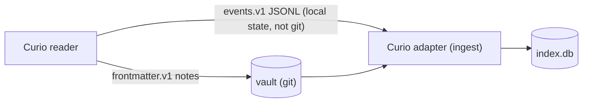

# Curio

Curio is the sibling open-source RSS reader. It integrates with
Curator **by adapter, never by template**: Curio emits its own vanilla formats, and Curator's Curio
adapter consumes them against vendored, sha-pinned schemas. Curio does
not know Curator exists.

## The two contracts

| contract | shape | carries |
|---|---|---|
| `curio.frontmatter.v1` | markdown notes with Curio frontmatter, exported into vault directories | saved articles — the durable reading record |
| `curio.events.v1` | append-only JSONL event log in a local state directory | behavioral reading history — **never committed to git** |



**Notes** land in the vault as plain markdown: the adapter reads
`curio.frontmatter.v1` natively and maps `curio_id` →
`kp_id: curio:<uuidv7>`. Curio is *not* required to emit `kp-note/v1`
frontmatter — the adapter does the mapping at the boundary.

**Events** are tailed from the configured state directory with
rotation-aware `(file, line)` cursors and deduplicated by `event_id`,
so re-reads and log rotation never double-count. They enrich the index
(what you actually read, when) but stay out of the canonical store.

## Sha-pinned schemas

The adapter validates every note and event against **vendored copies**
of Curio's published JSON Schemas — never against a live checkout. A
`PIN` file records the upstream commit and the sha256 of each vendored
file, and the test suite recomputes those hashes on every run: a silent
edit to a vendored schema fails the build until the pin is legitimately
re-synced. Adapter behavior is a function of a recorded upstream
commit, not of whatever the sibling repo looks like today.

## Ownership: the manifest oracle

Curio owns what it writes, and Curator enforces that mechanically:

- `.curio/**` is Curio's state — the plane never writes there, and the
  [proposal validator](../concepts.md#proposals-the-only-write-path)
  hard-rejects any proposal touching it.
- `.curio/manifest.json` is read as the **write-ownership oracle**:
  manifest-listed paths are Curio-owned at the managed-region level.
- Curator enrichment of a Curio note means companion content *below*
  the managed region, plus frontmatter keys outside Curio's machine-key
  set — never inside either. A Curio re-export re-renders its region
  and your enrichment survives.

## Configuration

```toml
[curio]
enabled = true
events_dir = "~/.local/share/curio/events"   # events.v1 tail target
notes_dirs = ["curio"]                       # vault-relative export dirs
```

With `[curio].enabled = true`, `curator ingest` folds both channels;
`curator doctor` reports the events directory and cursor state. See
[Configuration](../reference/config.md) for every key.
