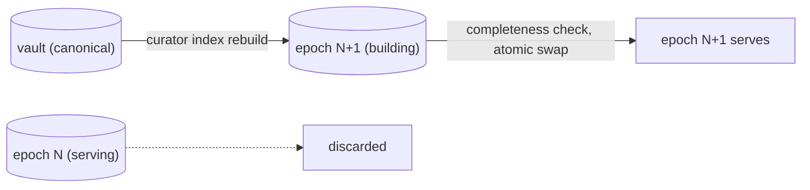

# Operations

Everything here follows from
[the canonical/derived split](concepts.md#the-sacred-split-canonical-vs-derived):
the vault is the only thing worth protecting, the index is a cache with
delusions of grandeur, and every upgrade is a rebuild away.

## Backup

**Back up the vault. Don't back up the index.**

| what | canonical? | backup story |
|---|---|---|
| the vault (markdown + `.kp/proposals/`) | yes | git remote(s) + whatever file backup you already trust |
| Zotero library | yes | Zotero's own sync/backup — Curator only reads it |
| `curator.toml` | yes (config) | commit it with the vault or your dotfiles; it contains no secrets by contract |
| secrets (API key, bearer token) | yes | your secret manager — they live in env vars, never in files Curator reads |
| `index.db`, `.kp/models/`, cursors | **no — derived** | none. `curator index rebuild` restores everything from canonical |

Restore drill: clone the vault, install the binary, `curator index rebuild`
(or `curator ingest` from empty), `curator zotero sync` if enabled.
There is no state to restore that a rebuild does not regenerate.

## Rebuild

```sh
curator index rebuild    # alias: curator reindex
```

Rebuilds are **blue/green**: the new epoch is built beside the serving
one, checked for completeness, then swapped atomically. A crash
mid-rebuild leaves the old epoch serving; readers never see a
half-built index.



Rebuild when `curator doctor` tells you to — typically after changing
`[index].embedder`, `chunk_tokens`/`chunk_overlap`, or upgrading across
a chunker/normalization change. Day-to-day, incremental
`curator ingest` is all you need.

## Upgrade by rebuild

There are **no schema migrations, ever** — an index epoch is a pure
function of its inputs
([epochs, not migrations](concepts.md#epochs-not-migrations)). The
upgrade procedure for any Curator version:

```sh
# 1. install the new binary (build from source while pre-release)
# 2. sanity-check config + index against the new binary
curator doctor
# 3. if (and only if) doctor flags a mismatch:
curator index rebuild
```

`curator doctor` compares the configured embedder identity and
dimensions against what the index was built with and says exactly what
to do. A version bump that doesn't change the epoch inputs costs
nothing; one that does costs one rebuild. Downgrade is the same
procedure in reverse — the vault never changes shape.

## Running on a server

A network deployment is the same binary plus three decisions: a
dedicated user, env-file secrets, and the HTTP transport. The shape
below is a plain Linux host or container with systemd; adjust paths to
taste.

Layout:

```text
/usr/local/bin/curator        # the binary
/etc/curator/curator.toml     # config (no secrets in it, by contract)
/etc/curator/curator.env      # secrets, root-readable only
/srv/vault                    # the vault (a git checkout)
```

### Serving MCP over HTTP

`[mcp]` in `curator.toml`:

```toml
[mcp]
transport = "http"
http_bind = "127.0.0.1:8377"
bearer_token_env = "CURATOR_MCP_TOKEN"
```

`/etc/curator/curator.env` (mode `0600`):

```sh
CURATOR_MCP_TOKEN=<long random string>
CURATOR_ZOTERO_KEY=<zotero api key, if enabled>
```

`/etc/systemd/system/curator-mcp.service`:

```ini
[Unit]
Description=Curator MCP surface (streamable HTTP + bearer)
After=network-online.target
Wants=network-online.target

[Service]
User=curator
Group=curator
EnvironmentFile=/etc/curator/curator.env
ExecStart=/usr/local/bin/curator mcp serve --http --config /etc/curator/curator.toml
Restart=on-failure
NoNewPrivileges=true
ProtectSystem=strict
ProtectHome=true
ReadWritePaths=/srv/vault

[Install]
WantedBy=multi-user.target
```

Notes on the shape:

- **There is no unauthenticated network mode.** The server resolves the
  bearer token *before* binding; if the env var is unset it refuses to
  start. That's a [contract rule](reference/mcp.md#binding-rules), not
  a default.
- `ReadWritePaths` covers the vault because `kp_propose` writes
  proposals into `<vault>/.kp/proposals/` — the one write the surface
  performs. Keep the index inside the vault's `.kp/` (as `curator init`
  scaffolds) or add its directory here too.
- Bind loopback and put a TLS reverse proxy or a private overlay
  network in front for anything beyond localhost; the bearer token is
  transport authentication, not transport encryption.

### Scheduled ingest and digests

Batch work is oneshot units on timers — one pair per job
(`curator-ingest`, `curator-zotero`, `curator-digest`):

```ini
# /etc/systemd/system/curator-ingest.service
[Unit]
Description=Curator incremental ingest

[Service]
Type=oneshot
User=curator
EnvironmentFile=/etc/curator/curator.env
ExecStart=/usr/local/bin/curator ingest --config /etc/curator/curator.toml
```

```ini
# /etc/systemd/system/curator-ingest.timer
[Unit]
Description=Run curator ingest hourly

[Timer]
OnCalendar=hourly
RandomizedDelaySec=5m
Persistent=true

[Install]
WantedBy=timers.target
```

Clone the pair with `curator zotero sync` (e.g. every 4 hours) and
`curator digest run --auto` (daily) as `ExecStart`. `--auto` applies a
digest proposal only when the
[auto-apply gate](concepts.md#proposals-the-only-write-path) admits it;
everything else waits in the queue for `curator review`.

### Watching it

```sh
curator doctor          # config / vault / index / cursors, human-readable
curator doctor --json   # same checks, machine-readable — feed your monitoring
```

`doctor` exits nonzero when any check errors, so it slots directly into
a healthcheck. Logs go to stderr (`RUST_LOG` overrides the default
`warn` level) — journald catches them as-is.
